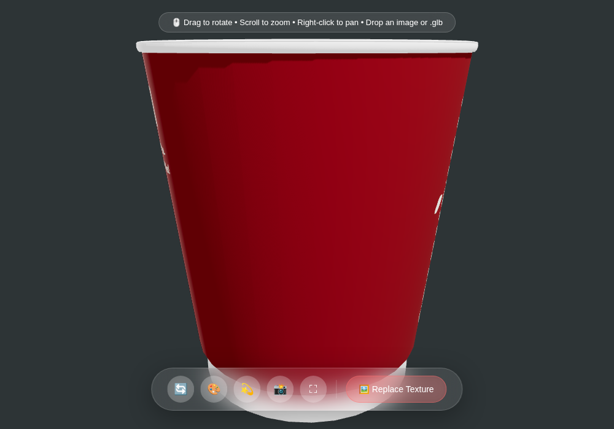

# 3D Cup Viewer

A small Three.js viewer for looking at a 3D model in the browser and trying
different textures on it. No build step — it's plain ES modules served off any
static host.



## Running it

The page loads its modules and assets over HTTP, so open it through a server
rather than double-clicking `index.html`:

```bash
python3 -m http.server 8000
# open http://localhost:8000
```

## Using a different model

Drag a `.glb`/`.gltf` file onto the page, or point `js/config.js` at it:

```js
assets: {
  model: 'assets/models/8cups.glb',
  texture: 'assets/textures/mockup.jpg',
}
```

The model is centered, scaled and framed for you.

## Changing the texture

Click **Replace Texture**, drop an image onto the page, or from the console:

```js
replaceTexture('assets/textures/mockup.jpg');
```

The texture is swapped in place — the model isn't reloaded.

## Controls

Drag to orbit, scroll to zoom, right-click to pan. The bottom bar and a few
keys handle the rest:

- `R` — reset the camera
- `B` — cycle the background
- `A` — toggle auto-rotate
- `S` — save a screenshot
- `F` — fullscreen

## Layout

```
index.html        markup
css/              styles
js/config.js      settings (camera, lights, zoom limits, backgrounds, shadows…)
js/main.js        entry point
js/Viewer.js      wires everything together
js/core/          scene, camera, renderer, lights, controls
js/loaders/       model + texture loading
js/ui/            buttons, shortcuts, drag & drop
js/utils/         shared helpers
assets/           models and textures
```

Almost everything you'd want to tweak lives in `js/config.js`. Three.js itself
is pulled from a CDN via the import map in `index.html`.
